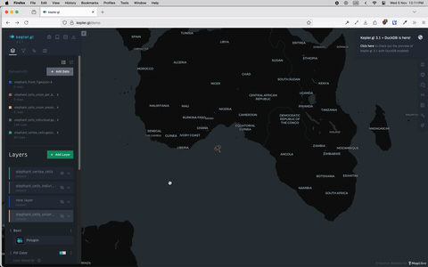
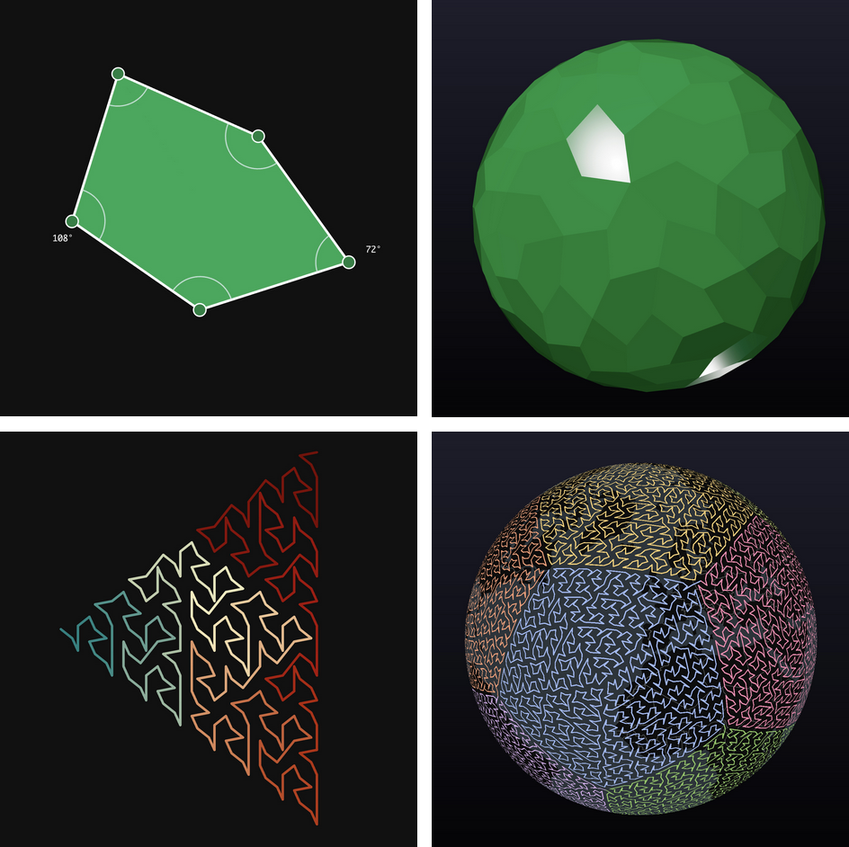

# a5pg

<p align="center">
  
</p>


Equal-area A5 spatial index functions for PostgreSQL. A5 is a Discrete Global Grid System based on irregular pentagons with low areal distortion—ideal for mapping densities across cities and continents. API compatible with DuckDB a5 extension.



**Links:** [A5 project](https://a5geo.org/) | [Rust crate](https://docs.rs/a5/latest/a5/)

## Versioning Policy

a5pg follows a versioning policy aligned with the underlying Rust library `a5`:
- **MAJOR.MINOR** versions are kept aligned with the `a5` Rust crate
- **PATCH** versions may diverge to track PostgreSQL extension-specific changes

This ensures API compatibility while allowing independent bug fixes and PostgreSQL-specific improvements.

## Documentation

- [Packaging Guide](docs/PACKAGING.md) - How to package and distribute a5pg
- [pgxman Guide](docs/PGXMAN_GUIDE.md) - Complete guide to publishing and installing via pgxman
- [Release Plan](docs/RELEASE_PLAN.md) - Release checklist and procedures
- [API Comparison](docs/API_COMPARISON.md) - Comparison with DuckDB a5 extension API

## Installation

### Using pgxman (recommended)

```bash
cargo install pgxman
pgxman install a5pg
```

### From Source

```bash
git clone https://github.com/decision-labs/a5pg.git && cd a5pg
cargo pgrx install pg17  # or pg15, pg16
```

Then enable: `CREATE EXTENSION a5pg;`

## Development

```bash
make help      # Show all targets
make test-all  # Test pg15, pg16, pg17
make schema    # Generate SQL schema
make docker-test  # Test in Docker (Linux)
```

See [docker/README.md](docker/README.md) for Docker options.

## Functions

**Core (DuckDB-compatible):**
- `a5_lonlat_to_cell(lon, lat, res) -> bigint` - Convert coordinates to cell ID
- `a5_cell_to_lonlat(cell_id) -> double precision[]` - Convert cell ID to [lon, lat]
- `a5_cell_to_boundary(cell_id) -> double precision[][]` - Get boundary coordinates
- `a5_get_resolution(cell_id) -> int` - Get cell resolution
- `a5_cell_to_parent(cell_id, target_res) -> bigint` - Get parent cell
- `a5_cell_to_children(cell_id, target_res) -> bigint[]` - Get children cells

**Extras:**
- `a5_lonlat_to_cell(lon numeric, lat numeric, res)` - Numeric overload
- `a5_point_to_cell(geom geometry, res)` - PostGIS wrapper (if geometry type exists)
- `a5pg_version() -> text`, `a5pg_info() -> jsonb` - Version info

## Examples

```sql
-- Convert coordinates to cell ID
SELECT a5_lonlat_to_cell(-73.9857, 40.7580, 10);
-- 2742822465196523520

-- Get center point [lon, lat]
SELECT a5_cell_to_lonlat(2742822465196523520);
-- {-73.96422570580987, 40.750993086983314}

-- Get boundary coordinates
SELECT a5_cell_to_boundary(2742822465196523520);
-- {{-74.01466735453606, 40.72977833231509}, ...}

-- Hierarchy operations
SELECT a5_get_resolution(2742822465196523520);  -- 10
SELECT a5_cell_to_parent(2742822465196523520, 8);
SELECT a5_cell_to_children(2742822465196523520, 12);
```

## Credits

- A5 DGGS created by [Felix Palmer](https://github.com/felixpalmer).
- The pg-extension made with ❤️ by the [geobase.app](https://geobase.app) team.

**CI:** Tests on `ubuntu-latest`, `macos-latest` with PostgreSQL 15, 16, 17. See [`.github/workflows/ci.yml`](.github/workflows/ci.yml).